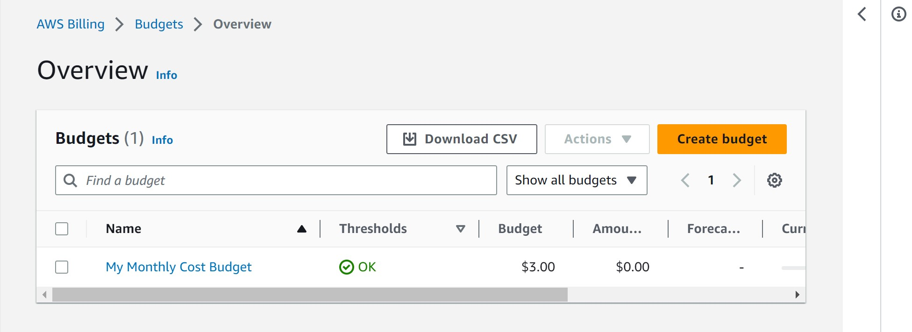

# New post title here
 CREATING A COST BUDGET
## Cloud Research

- ✍️ Document your trial and errors. Share what you tried to learn and understand about the cloud topic or while completing micro-project.
In order for IAM users to create budgets in the Billing and Cost Management console what else must these users be allowed to do? For IAM users to create budgets, they need to access the billing console which is given by the root user.

In addition to the console how else can you create budgets?

Is it better to set budgets on a recurring basis or for a specific time? And why? Well I think it should set on a monthly unless the specified services is supposed to run for a given time.

What are the different types of costs that make up a cost budget? Discounts,Taxes,Support charges, Recurring reservation charges,Upfront reservation charges,Other subscription costs.

What are the different options for setting budget alerts?Amazon SNS alert, AWS chart box alerts.
## Social Proof

